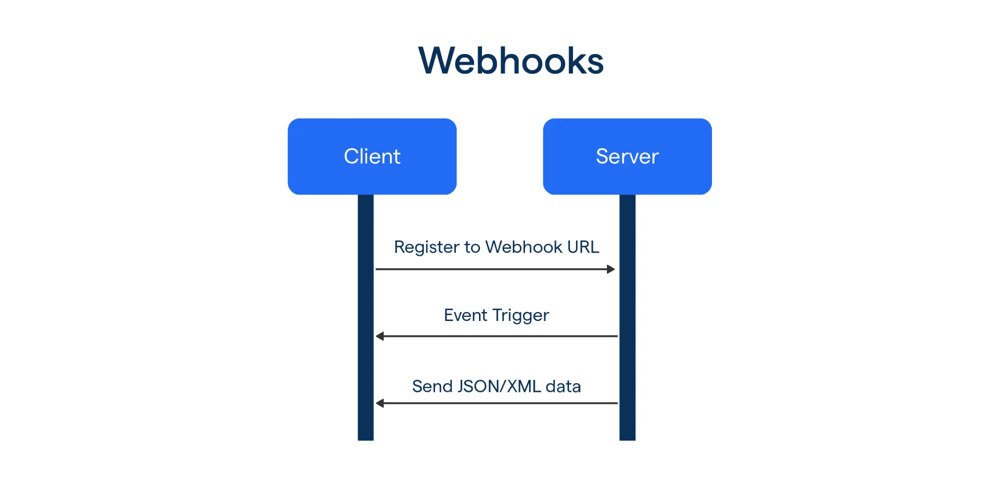

<div align="center">
  <a href="https://github.com/tyronejosee/prototype_actix_web" target="_blank">
    
  </a>
</div>
<div align="center">
  <h1><strong>Prototype WebSockets</strong></h1>
</div>
<br>
<p align="center">
A complete real-time chat application built with Django (backend) and React (frontend). Features include user authentication, private messaging, real-time communication via WebSockets, and a clean, modern UI.
<p>



WebSockets are a communication protocol that enables bidirectional and persistent communication between a server and a client over a single TCP connection. Unlike traditional methods such as HTTP, where the client makes a request and the server responds, WebSockets allow real-time communication, where the server can send data to the client at any moment without requiring the client to make a new request.

## ✨ Features

### Backend

- **User Authentication**: Registration and login with JWT tokens
- **WebSocket Support**: Real-time messaging using Django Channels
- **Private Chat**: Direct messages between users
- **Message Storage**: Persistent message history in database
- **REST API**: Endpoints for user management and message retrieval
- **Online Status**: Track user online/offline status

### Frontend

- **Authentication UI**: Login and registration forms
- **User Management**: View list of available users
- **Real-time Chat**: Instant messaging with WebSocket connection
- **Message History**: Load and display previous conversations
- **Typing Indicators**: See when someone is typing
- **Responsive Design**: Works on desktop and mobile devices

## ✅ Prerequisites

- Python 3.8+
- Node.js 14+
- Redis server

## ⚙️ Installation

### 🗄️ Backend Setup

Navigate to backend directory.

```bash
cd backend
```

Create virtual environment.

```bash
python -m venv venv

# Windows
venv\Scripts\activate

# Linux/Mac
source venv/bin/activate
```

Install dependencies.

```bash
pip install -r requirements.txt
```

Run migrations.

```bash
python manage.py makemigrations
python manage.py migrate
```

Create superuser.

```bash
python manage.py createsuperuser
```

Start development server.

```bash
python manage.py runserver
```

### 🎨 Frontend Setup

Navigate to frontend directory

```bash
cd frontend
```

Install dependencies.

```bash
npm install
```

Start development server.

```bash
npm run dev
```

## ⚖️ License

This project is under the [MIT License](LICENSE).

Enjoy! 🎉
